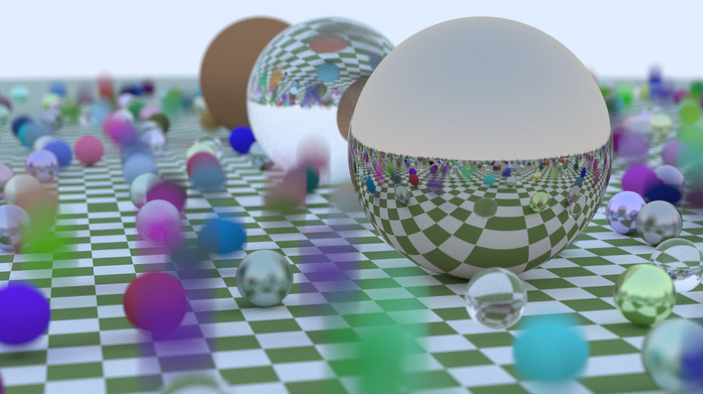

## Run the programme on Mac OS X

First, compile the programme using the `CMakeLists.txt` file like this.
```
mkdir build
cd build
cmake -DCMAKE_CXX_COMPILER=g++-14 ..
make
```

Then run the `./raytracer` in the `build` directory. You can use `> image.ppm` to redirect the output to a file named `image.ppm`. Execute the following command in the parent directory.
```
./raytracer > ../image.ppm
```

Of course, you can replace `image.ppm` with any other filename you like, and the result of defualt settings has already been saved in the `image.png` file.



## References

- [_Ray Tracing in One Weekend_](https://raytracing.github.io/books/RayTracingInOneWeekend.html)
- [_Physically Based Rendering:From Theory To Implementation_](https://pbr-book.org/)